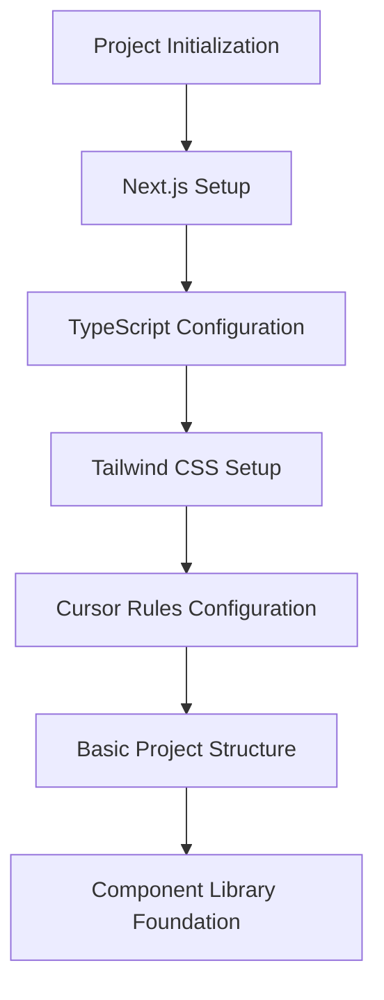
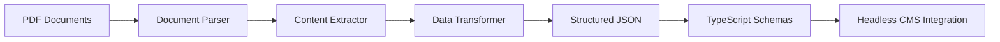
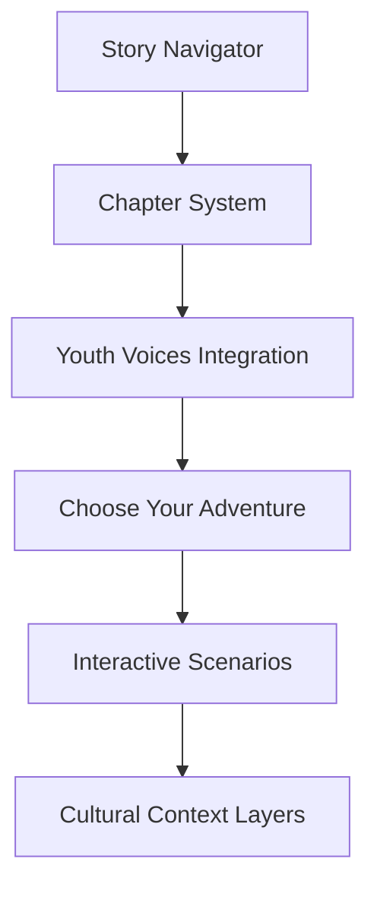
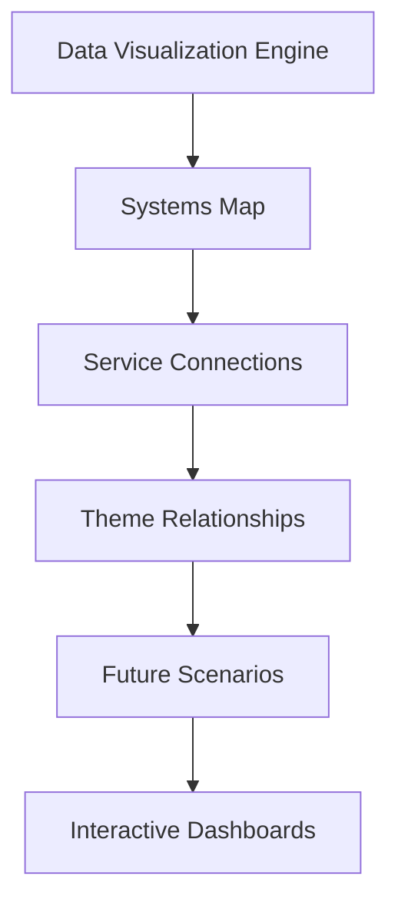
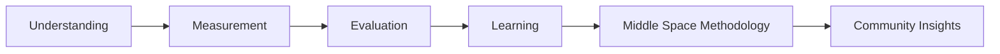
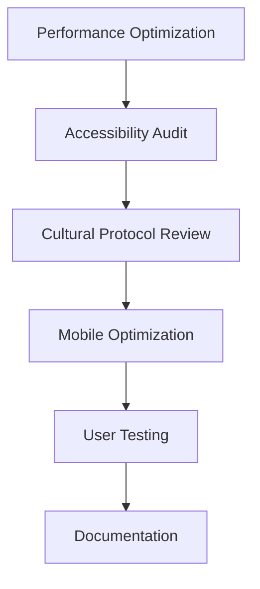
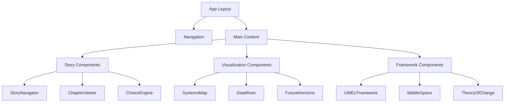
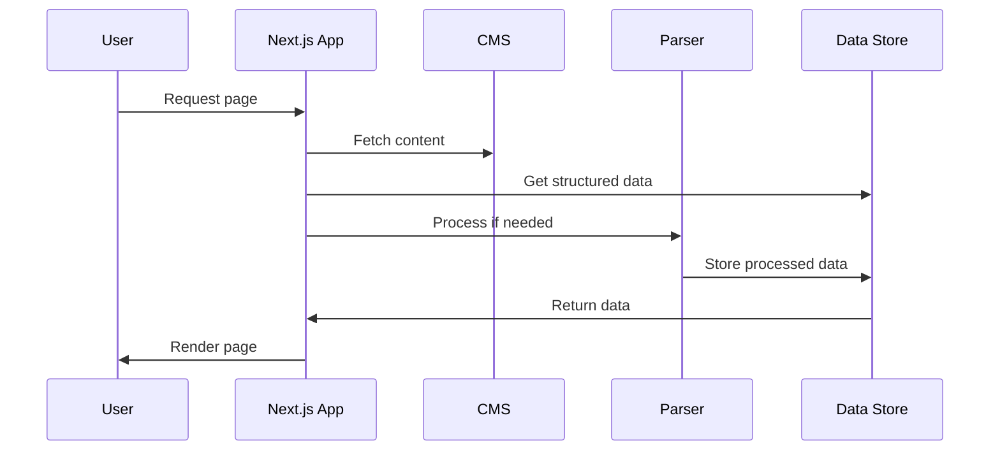
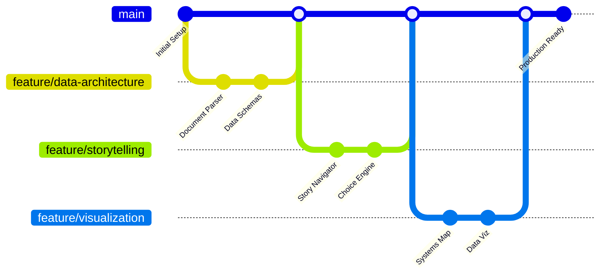

# 🏗️ Barkly Youth Dashboard: Implementation Plan

## Project Overview
Building a community research dashboard prototype focused on the Barkly Youth case study, using Next.js, TypeScript, and Tailwind CSS. The prototype will demonstrate key storytelling and visualization features while establishing patterns for future scalability.

## Timeline: 28 Days (4 Weeks)

### Phase 1: Foundation Setup (Days 1-3)



**Key Deliverables:**
- Next.js 14+ project with App Router
- TypeScript strict mode configuration
- Tailwind CSS with custom design system
- `.cursorrules` file optimized for the project
- Basic folder structure following specification
- Initial component library with design tokens

**Folder Structure:**
```
barkly-research-platform/
├── README.md
├── docs/
│   ├── project-knowledge/
│   │   ├── barkly-documents/          # All PDFs and source materials
│   │   ├── research-methodology/      # UMEL frameworks
│   │   ├── community-protocols/       # Cultural guidelines
│   │   └── analysis-frameworks/       # Systems thinking, theory of change
│   ├── development/
│   │   ├── cursor-prompts/           # Reusable prompts for Cursor
│   │   ├── component-specs/          # Detailed component documentation
│   │   └── scaling-strategy/         # Future expansion plans
│   └── user-guides/
├── src/
│   ├── app/                          # Next.js App Router
│   ├── components/
│   │   ├── core/                     # Reusable UI components
│   │   ├── visualization/            # Chart and data viz components
│   │   ├── storytelling/             # Narrative-driven components
│   │   └── frameworks/               # Analysis framework components
│   ├── data/
│   │   ├── projects/
│   │   │   ├── barkly-youth/         # Current project data
│   │   │   └── project-template/     # Template for new projects
│   │   ├── schemas/                  # Data structure definitions
│   │   └── transformers/             # Data processing utilities
│   ├── hooks/                        # Custom React hooks
│   ├── utils/                        # Utility functions
│   └── styles/                       # Tailwind configurations
├── cursor-rules/                     # Cursor-specific configurations
└── public/
    └── assets/
```

### Phase 2: Data Architecture & Document Processing (Days 4-7)



**Key Components:**
- Document processing pipeline for PDF extraction
- TypeScript interfaces for community data structures
- Headless CMS setup (Sanity or Strapi) for content management
- Data validation and transformation utilities
- Initial Barkly Youth data integration

**Data Schemas:**
```typescript
interface CommunityProject {
  id: string;
  name: string;
  region: string;
  culturalContext: {
    traditionalOwners: string[];
    languages: string[];
    culturalProtocols: CulturalProtocol[];
  };
  methodology: {
    type: 'UMEL' | 'Participatory' | 'Community-Led' | 'Mixed';
    frameworks: string[];
    dataSourceTypes: DataSourceType[];
  };
  participants: ParticipantGroup[];
  themes: CommunityTheme[];
  insights: Insight[];
  outcomes: Outcome[];
  timeline: ProjectPhase[];
}

interface CommunityTheme {
  id: string;
  title: string;
  description: string;
  youthVoices: Quote[];
  communityVoices: Quote[];
  serviceData: ServiceData[];
  supportingServices: Service[];
  systemConnections: SystemConnection[];
}
```

### Phase 3: Core Storytelling Features (Days 8-12)



**Key Features:**
- Interactive story navigation system
- Youth voice integration with quotes and insights
- Choose-your-own-adventure decision trees
- Cultural context overlays
- Mobile-responsive storytelling interface

**Component Architecture:**
```typescript
// Story Components
interface StoryChapter {
  id: string;
  title: string;
  narrative: string;
  culturalContext?: string;
  dataPoints: DataPoint[];
  nextChoices: string[];
  visualMetaphor: string;
}

interface AdventurePath {
  scenario: string;
  choices: Choice[];
  consequences: Consequence[];
  learningOutcomes: string[];
}
```

### Phase 4: Data Visualization & Systems Thinking (Days 13-17)



**Key Visualizations:**
- Interactive systems mapping
- Service provider network visualization
- Theme relationship diagrams
- Future scenario modeling
- Data flow visualizations

**Visualization Components:**
- `SystemsMap.tsx` - Interactive network visualization
- `DataRiver.tsx` - Flow visualization showing data movement
- `FutureHorizons.tsx` - Three horizons thinking visualization
- `ServiceNetwork.tsx` - Service provider connections
- `ThemeRelationships.tsx` - Theme interconnection mapping

### Phase 5: UMEL Framework Integration (Days 18-21)



**Framework Components:**
- UMEL methodology implementation
- "Middle Space" visualization
- Community co-design interfaces
- Learning outcome tracking
- Insight generation tools

**Framework Architecture:**
```typescript
// Framework Components
interface UMELFramework {
  understanding: UnderstandingPhase;
  measurement: MeasurementPhase;
  evaluation: EvaluationPhase;
  learning: LearningPhase;
  middleSpace: MiddleSpaceData;
}

interface MiddleSpaceData {
  communityKnowledge: CommunityInsight[];
  academicKnowledge: AcademicInsight[];
  sharedUnderstanding: SharedInsight[];
  collaborativeActions: Action[];
}
```

### Phase 6: Polish & Optimization (Days 22-28)



**Final Steps:**
- Performance optimization and code splitting
- Accessibility compliance (WCAG 2.1 AA)
- Cultural sensitivity review
- Mobile responsiveness testing
- Comprehensive documentation

## Technical Architecture


## Component Architecture



## Data Flow Architecture



## Development Workflow



## Cursor Configuration

### `.cursorrules` File:
```
# Barkly Research Platform - Cursor Rules

## Project Context
This is a sophisticated community research dashboard focusing on Indigenous-led research methodologies, particularly the Barkly Regional Deal Youth Case Study. The platform uses storytelling, systems thinking, and interactive visualization to make complex community data accessible and actionable.

## Code Standards
- Use TypeScript for type safety
- Follow React best practices with hooks
- Implement responsive design with Tailwind CSS
- Prioritize accessibility (WCAG 2.1 AA)
- Use semantic HTML and proper ARIA labels
- Write comprehensive JSDoc comments

## Component Architecture
- Build modular, reusable components
- Separate visualization logic from data logic
- Use composition over inheritance
- Implement proper error boundaries
- Design for multi-project scalability

## Data Handling
- Use immutable data patterns
- Implement proper loading states
- Handle edge cases gracefully
- Cache expensive computations
- Support offline functionality where possible

## Cultural Sensitivity
- Always respect Indigenous data sovereignty
- Follow CARE+ principles (Collective benefit, Authority to control, Responsibility, Ethics + Cultural safety)
- Implement appropriate access controls
- Use inclusive language and imagery
- Allow for customization of cultural elements

## Performance
- Optimize for mobile devices
- Implement code splitting
- Use React.memo for expensive components
- Optimize images and assets
- Monitor bundle size

## Accessibility
- Ensure keyboard navigation works everywhere
- Provide proper focus management
- Use sufficient color contrast
- Support screen readers
- Implement proper heading hierarchy

## When building new features:
1. Consider how it scales to other projects
2. Think about cultural appropriateness
3. Ensure mobile responsiveness
4. Add proper TypeScript types
5. Include error handling
6. Write clear documentation
```

## Scalability Preparation

Even though we're building a prototype first, we'll establish patterns that enable easy scaling:

1. **Modular Architecture**: Components designed for reuse across projects
2. **Configuration System**: Project-specific settings and customizations
3. **Data Abstraction**: Generic interfaces that can accommodate different community projects
4. **Cultural Protocol Framework**: Extensible system for different Indigenous communities
5. **Documentation Standards**: Clear patterns for adding new projects

## Success Metrics for Prototype

**Technical:**
- ✅ Mobile-responsive design (Lighthouse score >90)
- ✅ Accessibility compliance (WCAG 2.1 AA)
- ✅ Fast loading times (<3s initial load)
- ✅ TypeScript coverage >95%

**Functional:**
- ✅ Complete Barkly Youth story integration
- ✅ Interactive systems visualization
- ✅ Choose-your-adventure functionality
- ✅ UMEL framework implementation

**Cultural:**
- ✅ Indigenous data sovereignty principles
- ✅ CARE+ compliance
- ✅ Cultural protocol integration
- ✅ Community voice amplification

## Risk Mitigation

1. **Data Sensitivity**: Implement proper access controls and anonymization
2. **Cultural Appropriateness**: Regular community feedback loops
3. **Technical Complexity**: Incremental development with regular testing
4. **Scalability Debt**: Document scaling decisions for future refactoring

## Cursor Development Prompts

### Component Generation Prompt:
```
Create a new [component type] component for the Barkly Research Platform that:

- Follows our established patterns in src/components/[category]/
- Uses TypeScript with proper interfaces
- Implements accessibility best practices
- Includes proper error handling
- Is designed for multi-project scalability
- Respects Indigenous data sovereignty principles
- Uses Tailwind for styling with our design system

Context: [Specific context about what this component should do]

Reference similar patterns from: [existing component if applicable]

Cultural considerations: [any specific cultural protocols to follow]
```

### Data Integration Prompt:
```
Help me integrate data from [document/source] into our knowledge base system:

1. Analyze the content for key themes and insights
2. Extract structured data according to our schemas
3. Identify cultural protocols and sensitivities
4. Generate appropriate metadata
5. Create connections to existing project data
6. Suggest visualization approaches

Use our established patterns in src/data/ and follow CARE+ principles.
```

### Feature Scaling Prompt:
```
Design this feature to work for multiple community research projects:

Current context: Barkly Youth Case Study
Feature: [specific feature]

Consider:
- How would this work for different Indigenous communities?
- What cultural customizations are needed?
- How can we make this reusable without losing specificity?
- What configuration options should we provide?
- How do we maintain cultural sensitivity across contexts?

Generate both the specific implementation and the abstraction layer.
```

## Next Steps

1. **Foundation Setup**: Initialize Next.js project with TypeScript and Tailwind
2. **Document Processing**: Set up PDF parsing and data extraction pipeline
3. **Core Components**: Build storytelling and visualization components
4. **UMEL Integration**: Implement framework-specific features
5. **Testing & Optimization**: Ensure accessibility and performance standards

This plan balances rapid prototype development with thoughtful architecture that will support future scaling to other Indigenous community research projects.